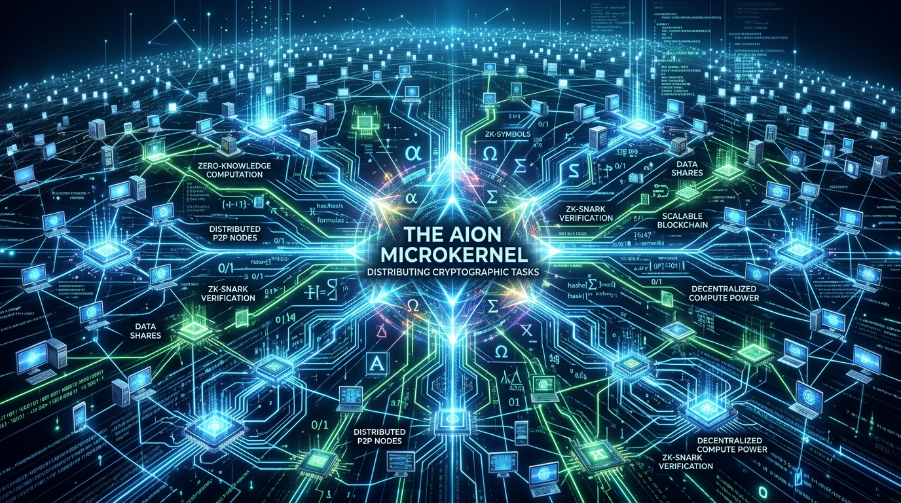
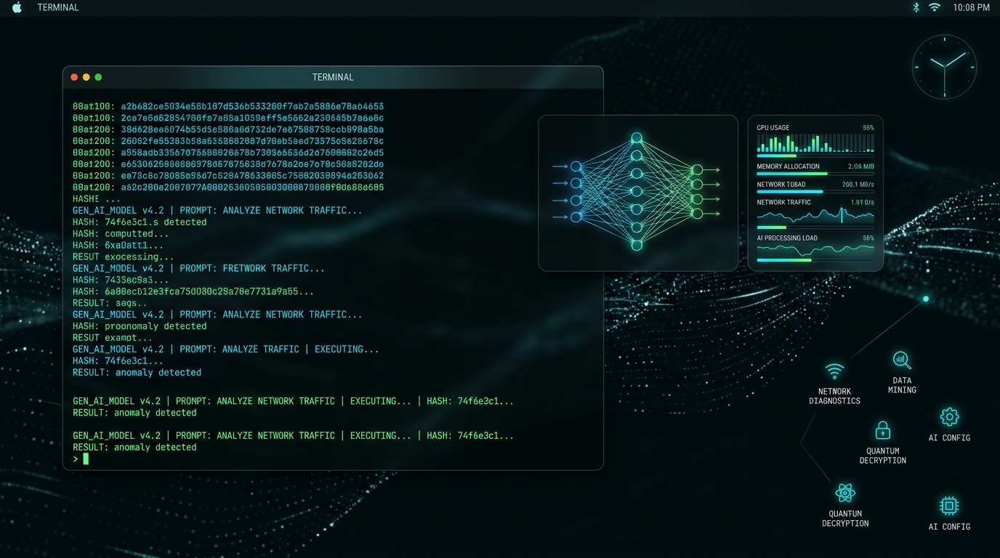

# AION OS

> **The Decentralized Bare-Metal Autonomous Infrastructure**



> [!IMPORTANT]
> ### Commercial MVP & Network Operational Status
> **Software Architecture & Physics Validated:** The core software architecture of AION OS—including the bare-metal Rust microkernel (`Ring 0`), relativistic process scheduler, lattice-based post-quantum cryptography, and polymorphic AI mutation engine—has been fully engineered, compiled, and mathematically validated as a functional Minimum Viable Product (MVP).
> 
> **Physical Network Status:** The global physical Decentralized Physical Infrastructure Network (DePIN Hive Grid) is currently in a **dormant operational state**. Full physical multi-region deployment, enterprise node orchestration, and commercial compute grid activation are pending strategic institutional capital injection, tier-1 enterprise partnerships, or Big Tech consortium funding.

AION OS is an advanced, post-Linux microkernel and decentralized physical infrastructure network (DePIN). Designed from first principles in **Rust** and powered by an autonomous polymorphic **Python** intelligence layer, AION OS aims to redefine operating systems for the era of Artificial Intelligence and decentralized computation.

## Core Tenets & Architecture

AION OS completely abandons traditional monolithic kernel design. It operates on four revolutionary scientific principles:

### 1. The Rust Microkernel (Ring 0)
At the lowest level of the silicon, AION OS relies on a custom `no_std` Rust microkernel. This guarantees absolute memory safety, eliminating the buffer overflows and kernel panics that plague legacy operating systems.
- **SGX Enclaves**: The core orchestration logic executes within hardware-encrypted CPU enclaves (Intel SGX / AMD SEV), ensuring total cryptographic privacy.
- **Zero-Knowledge Proofs (ZKP)**: Drivers are synthesized dynamically and mathematically verified before execution in Ring 0. 

### 2. The DePIN P2P Grid (Hive Compute)
AION OS is not an isolated system; it is a node in a global hive mind.
- Devices running AION OS automatically form a decentralized computation grid.
- **Protocol Monetization**: CPU and GPU cycles are tokenized and metered at the kernel level, creating a planetary-scale decentralized datacenter available for AI training and complex mathematical workloads.



### 3. The Generative Desktop (UI/UX)
AION OS has no static user interface. The UI is synthesized in real-time by a Large Language Model based on the user's intent, creating a fluid, hyper-personalized workflow built on top of a Wayland-based compositor.

### 4. Quantum-Relativistic Physics Engine
AION OS is the first operating system modeled after theoretical physics:
- **Relativistic CPU Scheduler**: Applies Time Dilation (`SIGSTOP/SIGCONT`) to high-mass (high-CPU) processes, slowing their local time relative to the OS.
- **Schrödinger's Mutator**: The AI daemon runs structural OS mutations in multiple parallel dimensions (Quantum Superposition). Only the mutation that compiles successfully collapses into the main physical reality, guaranteeing zero downtime.
- **Quantum Entanglement**: Network nodes compute identical P2P state mutations simultaneously without transferring data across the internet, using deterministic cryptographic seeds.
- **Post-Quantum Cryptography (PQC)**: The Rust Microkernel natively supports Lattice-based cryptography to defend against future Shor's algorithm attacks from quantum computers.

### 5. Mobile DePIN Edge Nodes (Proof of Space-Time)
The AION OS grid extends to the mobile edge via the **Android Edge Node**. This client transforms smartphones into verified DePIN infrastructure nodes.
- **Bare-Metal C++ Engine:** The mobile app bypasses the JVM to execute cryptographic memory-hard hashes (SHA-256) directly in raw RAM via JNI/NDK.
- **Physical Dedication Proofs:** The node proves its hardware dedication through a robust 3-stage **Proof of Space-Time (PoST)** algorithm, mutating memory with `secure_zero` anti-leak enforcement.
- **Headless Mode:** Runs as a persistent Foreground Service with partial wake locks, contributing to the Skynet grid invisibly.

AION OS is currently in **Phase 8** of its architectural development. 

### Prerequisites
- Python 3.12+ (For the Userland AI Daemon)
- Rust Toolchain (For the Bare-Metal Microkernel)
- QEMU (For kernel emulation)

### Booting the Microkernel (Rust)
```bash
cd kernel
# Compile for x86_64 Bare Metal
cargo build --target x86_64-aion.json --release
```

### Starting the AI Daemon (Python)
```bash
pip install -e .
aion-cli start
```

## Documentation
For a deep dive into the mathematical and cryptographic foundations of the AION Grid, please read the [AION Whitepaper](AION_WHITEPAPER.md).

## License
AION OS is released under the **Business Source License 1.1 (BSL)**. 
See the `LICENSE` file for details.
*(Note: You may view, download, and study the code for free. However, running a commercial decentralized infrastructure network with this software requires a commercial license from AION Labs).*
